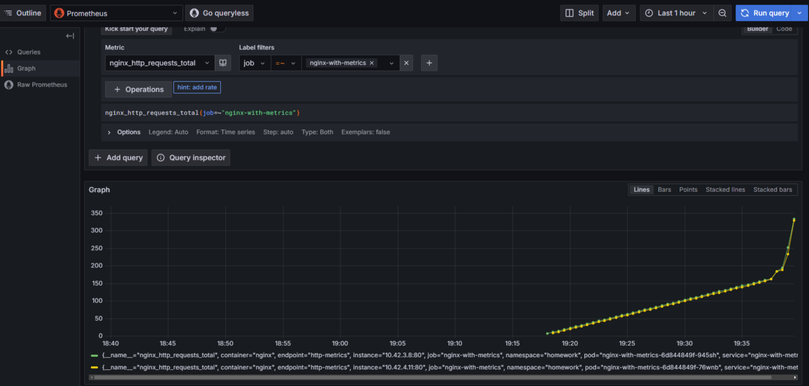

## Настройка мониторинга Nginx с Prometheus

1. **Создать кастомный образ Nginx**  
   Необходимо создать кастомный образ Nginx, отдающий свои метрики на определенном endpoint (пример из официальной документации в разделе ссылок).

   Для создания образа nginx создан `Dockerfile` с файлами `nginx.conf`, `start.sh`. Этот образ представляет собой сервис `nginx` со встроенным nginx-prometheus-exporter, отдающим метрики по endpoint `/metrics`. Данный образ уже залит на Docker Hub: demakovnik/nginx-fixed:latest 

2. **Установить в кластер Prometheus-operator**  
   Установить любым удобным вам способом (рекомендуется ставить либо по ссылке из официальной документации, либо через helm-чарт).

   Находясь в текущей папке, нужно установить prometheus operator командой:

   ```bash
   $ kubectl create ns monitoring
   $ helm install prometheus prometheus-community/kube-prometheus-stack -n monitoring -f values.yaml
   ```

   Для установки кастомного сервиса nginx нужно выполнить команду:
   ```bash
   kubectl apply -f nginx-manifests -n homework
   ```

3. **Создать Deployment и Service**  
   Создать Deployment, запускающий ваш кастомный Nginx образ, и Service для него.

   Файл Deployment - `nginx-manifests/nginx-deployment.yaml`
   Файл Service - `nginx-manifests/nginx-service.yaml`


4. **Настроить Nginx Prometheus Exporter**  
   Настроить запуск Nginx Prometheus Exporter (отдельным подом или в составе пода с Nginx - не принципиально) и сконфигурировать его для сбора метрик с Nginx.

   После установки helm-чарта Prometheus Operator должна осуществляться сборка метрик для сервиса. Можно проверить в Grafana по адресу: http://grafana.cluster.local/explore?schemaVersion=1&panes=%7B%22hli%22:%7B%22datasource%22:%22prometheus%22,%22queries%22:%5B%7B%22refId%22:%22A%22,%22expr%22:%22nginx_http_requests_total%7Bjob%3D~%5C%22nginx-with-metrics%5C%22%7D%22,%22range%22:true,%22instant%22:true,%22datasource%22:%7B%22type%22:%22prometheus%22,%22uid%22:%22prometheus%22%7D,%22editorMode%22:%22builder%22,%22legendFormat%22:%22__auto%22,%22useBackend%22:false,%22disableTextWrap%22:false,%22fullMetaSearch%22:false,%22includeNullMetadata%22:true%7D%5D,%22range%22:%7B%22from%22:%22now-1h%22,%22to%22:%22now%22%7D%7D%7D&orgId=1
   

5. **Создать ServiceMonitor**  
   Создать манифест ServiceMonitor, описывающий сбор метрик с подов, которые вы создали.
   Созданный файл: `nginx-manifests/nginx-servicemonitor.yaml` нужно задеплоить в кластер:
   ```bash
   kubectl apply -f nginx-manifests/nginx-servicemonitor.yaml -n homework
   ```